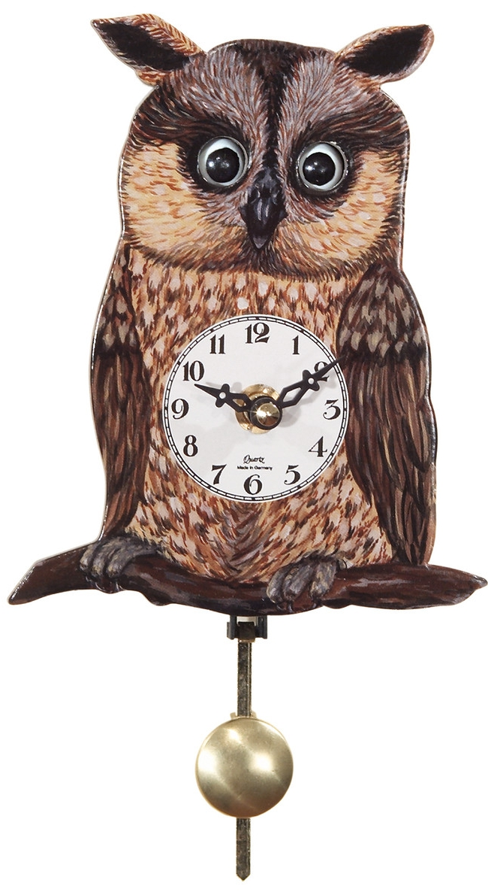

# **Grandma's Clock**

## **Introduction**

Grandma's Clock is a Python project in which we have created a clock system displayed
in the computer terminal. At the opening of the program, a menu allows the user to choose
to display the curent local time, choose his clock time, set an alarm or change the hours
display. While the clock is displayed, it can be paused using a keyboard interrupt.

- Language used: Python
- Libraries used: datetime, keyboard, os, time

## **Installation**

To install Grandma's Clock, follow these steps:

1. Clone this repository: **`git clone https://github.com/thibault-caron/clock`**
2. Download the Python language: **https://www.python.org/downloads/**
3. Install the keyboard library: **`pip install keyboard`**
4. Navigate to the project directory: **`cd clock`**

## **Usage**

To use Grandma's Clock, follow these steps:

1. Open the computer terminal.
2. Navigate to the project directory: **`cd clock`**
3. Launch the clock.py file: **`py clock.py`** or **`python clock.py`** or **`python3 clock.py`**
4. Play the game.

## **License**

Grandma's Clock is released under the GPL 3.0 License. 
See the **[LICENSE](https://www.gnu.org/licenses/gpl-3.0.html)** file for details.

## **Authors and Acknowledgment**

Grandma's Clock was created by :

- **[Thibault CARON](https://github.com/thibault-caron)**
- **[Anna LEITE](https://github.com/anna-leite)**
- **[Lorenzo OTTAVIANI](https://github.com/lorenzo-ottaviani)**

Thank you to all the contributors for their hard work and dedication to the project.
